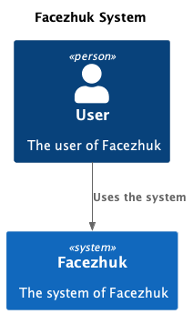
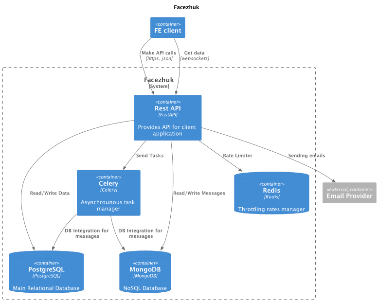
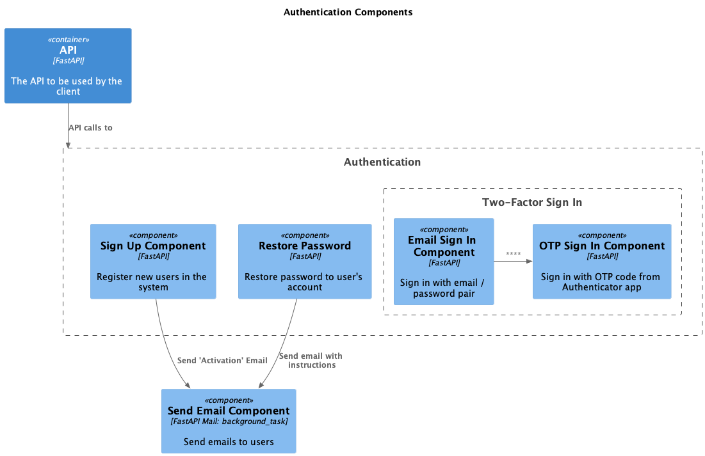
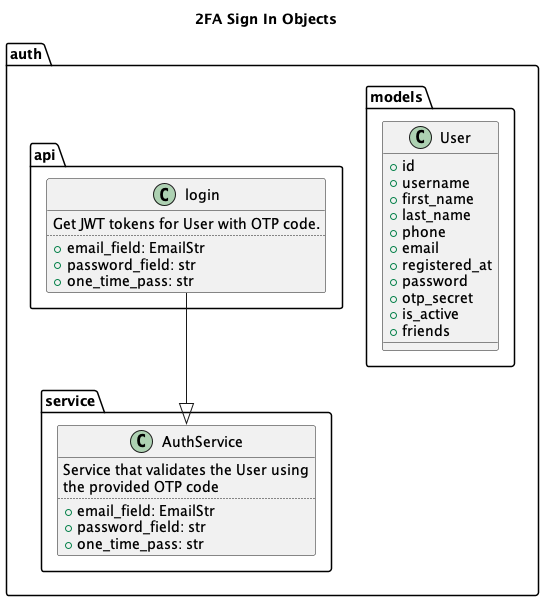

# About Project

Facezhuk - is a social network that allows users to interact with each other.

Users are able to:

* Sign up/sign in
* Sing up/sign in with Google and Facebook
* Authenticate using authenticator app (2FA)
* Change the profile information, including changing and restoring password
* Send friend requests therefore they could accept/reject friendship
* Receive real-time notification when a friendship request is sent and a new chat message is received.
* Chat with each other
* Scroll chat messages

## C4

Instead of describing the project, let's better look at the visual architecture of it.

## System level

* **User** - User of the system
* **Facezhuk** - Social network where users can interact with each other

## Containers level

* **Email Provider**  - Used for sending email messages to users
* **Redis** - Used as a throttling rates manager.
* **PostgreSQL** - Used for storing all data about users, their profiles, and messages backups.
* **MongoDB** - Used for storing user messages.
* **FE** - Client application
* **Celery** - Processor that manages all background work, e.g. creating messages backups.
* **API** - Provides Facezhuk functionality via API. Used for data processing, communication between users, sending notifications etc.
 
## Authentication Components

## Authentication Components

## Technologies

As a main framework here we're using [FastAPI](https://fastapi.tiangolo.com/). It is async, fast and modern.

As a main DB, we're using PostgreSQL, it is fast, reliable, scaled.
Also we use MongoDB which is used for storing user messages
There's an integration between MongoDB and PostgreSQL for messages backups using Celery periodic task.
Also, we're using Redis for as a throttling rates manager.
