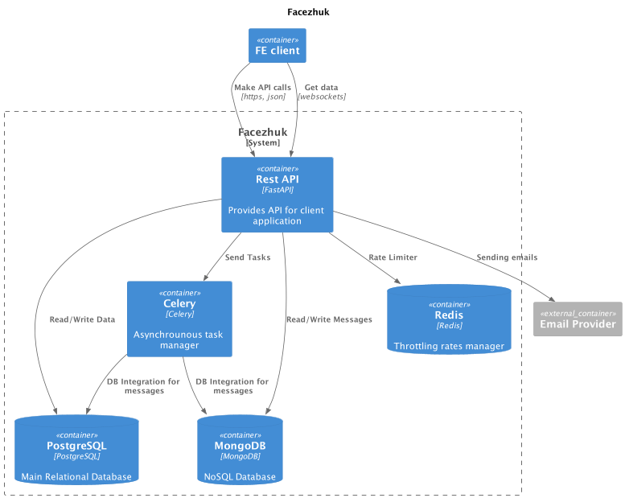

# Facezhuk API

Facezhuk - is a social network that allows users to interact with each other.

### Runtime environment

The infrastructure of WebsiteBuilder consists of the following services:
* Facezhuk application
* PostgreSQL database
* MongoDB database
* Redis in-memory database
* Email Provider for sending messages
* Celery background processor



### API documentation

API documentation can be found following these links

```shell script
# Swagger documentation
<api_url>/docs
# Swagger redoc documentation
<api_url>/redoc
```

 ### Development environment
 
 Development highly bound to docker, so there is `docker-compose-dev.yml` for development and
run `python main.py ` and `celery ...` by your PyCharm IDE.
**NOTE** you need to pass environment variable in your PyCharm Run configuration.
We use [Pipenv](https://pipenv.pypa.io/) for this project.
To install packages simply run `pipenv install` right after you configured your environment.

### Test environment
* All external dependencies must be mocked in tests.
* Use `coverage run -m pytest` to measure test coverage. This can be integrated with your PyCharm IDE
* Use `coverage report` to get coverage results.
* Use `flake8` to check following PEP8 rules

### Commands

Run uvicorn dev server

```shell
python main.py
```

Run all tests

```shell
pytest
```

Run locust tests

```shell
locust -f ./tests/locustfiles/chats.py
```

#### Alembic commands

Run create migrations command

```shell
alembic revision --autogenerate 
```

Run apply migration command

```shell
alembic upgrade head
```

Run downgrade migration command

```shell
alembic downgrade <migration name>
```

Run migration history

```shell
alembic history
```

#### Celery commands

Run celery

```shell
celery -A chat.tasks worker -l INFO
```

Run celery beat

```shell
celery -A chat.tasks beat -l INFO
```

